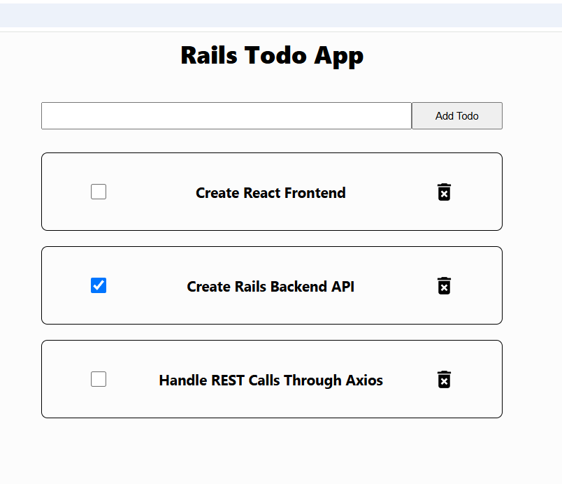

### Todo App with Ruby on Rails as a backend API paired with a React.js frontend. Nothing more, nothing less. 

  
  
  
  

### Ruby on Rails

cd into the backend folder and run `rails s` to start the backend server

### React

In a new terminal cd into the frontend folder and run`npm start` to start the frontend server

### Axios
Download Axios for handling HTTP requests to the backend through npm in the frontend folder by running `npm install axios` 

